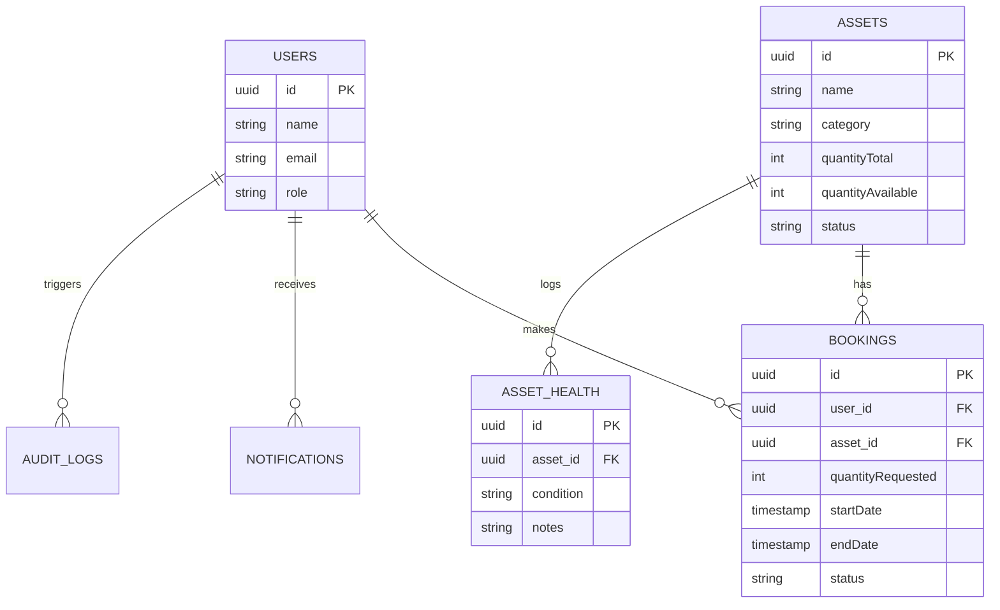

# Deliverable 2: Design Document

## 1. Problem Understanding
Modern organizations struggle to effectively manage, track, and optimize the utilization of shared physical assets (e.g., laptops, projectors, vehicles, specialized equipment). Traditional methods like spreadsheets or legacy systems lack real-time visibility, automated approval workflows, and condition tracking. This leads to:
- **Asset hoarding:** Employees booking assets without returning them.
- **Lost productivity:** Teams unable to locate available equipment when needed.
- **Maintenance neglect:** Lack of visibility into asset health and damage history.

**AssetFlow** solves these issues by providing a centralized, mobile-first platform for real-time inventory management, automated booking approvals, integrated QR-code scanning for rapid processing, and detailed utilization analytics.

## 2. System Architecture
AssetFlow follows a modern, edge-ready architecture utilizing the Next.js App Router for both server-rendered and client-side experiences.

- **Frontend:** Next.js 16 (React 19) with Tailwind CSS v4, Framer Motion, and shadcn/ui.
- **Backend/API:** Next.js Server Actions and Route Handlers handling core logic securely on the server.
- **Database:** Neon Serverless Postgres.
- **ORM:** Drizzle ORM.
- **Authentication:** Auth.js (NextAuth v5) using JWT sessions and role-based access control (`Admin` and `Consumer`).
- **Background Jobs:** Vercel Cron Jobs for automated overdue asset tracking and notifications.
- **Deployment:** Containerized via Docker or serverless deployment on Vercel.

## 3. Database Schema
The database uses a relational model optimized for rapid querying and transactional integrity during concurrent bookings.

### Core Tables:
1. **users:** Stores user identities, hashed passwords, and roles (`Admin`, `Consumer`).
2. **assets:** Stores physical inventory details, total capacity, available capacity, and current status (`Available`, `In Use`, `Maintenance`, `Retired`).
3. **bookings:** Tracks reservation requests, linking users to assets with requested dates and dynamic statuses (`Pending`, `Approved`, `Rejected`, `Returned`).
4. **asset_health:** Maintains a historical log of asset condition reports (e.g., Excellent, Damaged) and maintenance notes.
5. **notifications:** Stores in-app alerts and warnings for users.
6. **audit_logs:** An immutable ledger of critical system events (asset creation, approval decisions, deletions) for accountability.

## 4. Entity Relationship Diagram (ERD)

## 5. API Overview
Instead of traditional REST APIs, AssetFlow primarily uses **Next.js Server Actions** for tightly-coupled, type-safe RPC calls between the client and server.

- `requestBooking(assetId, quantity, dates)`: Validates stock and opens a pending reservation.
- `approveBooking(bookingId)` / `rejectBooking(bookingId)`: Admin controls that mutate booking states and trigger automated Email/In-App notifications.
- `returnBooking(bookingId)`: Closes an active booking and restores the `quantityAvailable` to the parent asset.
- `updateAssetHealthAction(assetId, condition, notes)`: Appends a new health record to the asset's history.
- `GET /api/cron`: A secure, token-protected REST endpoint triggered daily by Vercel to sweep for overdue bookings and dispatch warnings.

## 6. Design Decisions
- **Mobile-First QR Scanning:** Integrated `html5-qrcode` to allow admins to use their smartphone cameras to instantly identify and process asset returns.
- **Transaction Isolation:** Bookings use Drizzle's `FOR UPDATE` row-level locks within a standard Postgres transaction to prevent race conditions when multiple consumers attempt to book the same scarce asset simultaneously.
- **Decoupled Notifications:** In-app notifications are written synchronously for immediacy, while SMTP emails (`nodemailer`) are wrapped in `try/catch` blocks so that a temporary email provider failure does not rollback a successful booking approval.
- **Edge to Node Migration:** The platform originally targeted Cloudflare Edge, but was migrated to standard Node.js Serverless to support mature ecosystem libraries (like Nodemailer for SMTP) seamlessly on Vercel without complex Web Socket proxies.
